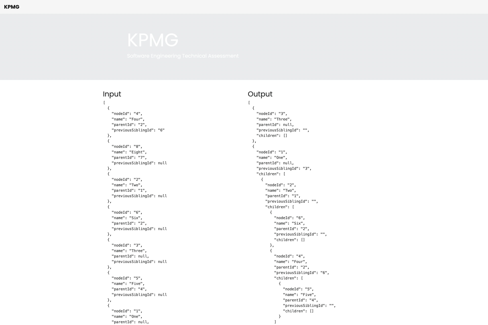

# KPMG

## Introduction

In this exercise you are presented with a flat array of unsorted nodes. Each node has the following properties

- `nodeId` The ID of the node
- `name` A sample property associated with the node
- `parentId` The ID of the parent node
- `previousSiblingId` The ID of the node that appears as direct previous sibling

The nodes require rearranging, so you are expected to implement a solution that can rearrange this flat array of nodes into a sorted tree structure, where every node is placed under its parent and along with its siblings.

If a null value is given for either parentId or previousSiblingId, that is because it either has no parent (root-level of the tree) or is the first child of its parent, respectively.

If a node is a parent of other node(s), these "children" should appear in an array property called children on the parent node. If a node has no child nodes, this children array will be empty.

You can find the expected output here for clarity.

## Requirements

- You are not expected to mutate any input whilst deriving the output.
- There can be many root-level nodes.
- Expect that a node can have an arbitrary quantity of siblings.
- Expect an arbitrary depth of nodes (children of children).

## Deliverables

1. Your solution (that takes in the provided input and creates the expected output).
2. Instructions to run the code.
3. Comments throughout the code that highlights your thinking process

## How can I run this?

The more easy way is to: 

1. open *vscode*, 
2. click on *extensions*
3. download *live server*
4. bottom-right corner you should see a *live* icon, click on the icon





# Show me what you got

This is our staring point:

```
const nodes = [
	{
		nodeId: "4",
		name: "Four",
		parentId: "2",
		previousSiblingId: "6",
	},
```

We should always avoid mutations, any developer who used *Reactjs* at least once in his life knows that, but we are still missing a very important prop here `children`

> How can we fix this?

We are gonna use `map()`: this method not only will return a new array but we are also deep cloning our collection thanks to the *spread operator* `...item`

```

	const data = nodes.map((item) => {
		return {
			...item,
			children: [],
		};
	});
```

Now, there are many ways to approach this problem and it's very easy to endup in an endless series of loops to achieve our goal.
When you find yourself in a situation like this, well it's probably a good time for using `reduce` ;)

```
	const result = data.reduce((acc, current) => {
		const match = acc.find((item) => item.nodeId == current.parentId);
		if (match) {
			match.children.push(current);
		} else {
			acc.push({
				nodeId: current.nodeId,
				name: current.name,
				parentId: current.parentId,
				previousSiblingId: current.previousSiblingId,
				children: current.children,
			});
		}
		return acc;
	}, []);
```

Let's open the console:

```
[
    {
        "nodeId": "4",
        "name": "Four",
        "parentId": "2",
        "previousSiblingId": "6",
        "children": [
            {
                "nodeId": "5",
                "name": "Five",
                "parentId": "4",
                "previousSiblingId": "",
                "children": []
            }
        ]
    },
    {
        "nodeId": "8",
        "name": "Eight",
        "parentId": "7",
        "previousSiblingId": "",
        "children": []
    },
    {
        "nodeId": "2",
        "name": "Two",
        "parentId": "1",
        "previousSiblingId": "",
        "children": [
            {
                "nodeId": "6",
                "name": "Six",
                "parentId": "2",
                "previousSiblingId": "",
                "children": []
            }
        ]
    },
    {
        "nodeId": "3",
        "name": "Three",
        "parentId": null,
        "previousSiblingId": "",
        "children": []
    },
    {
        "nodeId": "1",
        "name": "One",
        "parentId": null,
        "previousSiblingId": "3",
        "children": []
    },
    {
        "nodeId": "7",
        "name": "Seven",
        "parentId": null,
        "previousSiblingId": "1",
        "children": []
    }
]
```

This is working but it stops after the first cycle?!?

>How can we fix this?

We want to iterate as many times as it's needed and compare all the `nodeId` props against the `parentId` props.
To do that we just need a minor change:

- <s>`const match = acc.find((item) => item.nodeId == current.parentId);`</s>
- `const match = data.find((item) => item.nodeId == current.parentId);`

Let's take a second look at the console:

```
[
    {
        "nodeId": "3",
        "name": "Three",
        "parentId": null,
        "previousSiblingId": "",
        "children": []
    },
    {
        "nodeId": "1",
        "name": "One",
        "parentId": null,
        "previousSiblingId": "3",
        "children": [
            {
                "nodeId": "2",
                "name": "Two",
                "parentId": "1",
                "previousSiblingId": "",
                "children": [
                    {
                        "nodeId": "4",
                        "name": "Four",
                        "parentId": "2",
                        "previousSiblingId": "6",
                        "children": [
                            {
                                "nodeId": "5",
                                "name": "Five",
                                "parentId": "4",
                                "previousSiblingId": "",
                                "children": []
                            }
                        ]
                    },
                    {
                        "nodeId": "6",
                        "name": "Six",
                        "parentId": "2",
                        "previousSiblingId": "",
                        "children": []
                    }
                ]
            }
        ]
    },
    {
        "nodeId": "7",
        "name": "Seven",
        "parentId": null,
        "previousSiblingId": "1",
        "children": [
            {
                "nodeId": "8",
                "name": "Eight",
                "parentId": "7",
                "previousSiblingId": "",
                "children": []
            }
        ]
    }
]
```

It worked. Awesome!

It's not over yet... can you see what's wrong here?

```
"children": [
    {
        "nodeId": "4",
        "name": "Four",
        "parentId": "2",
        "previousSiblingId": "6",
        "children": [
            {
                "nodeId": "5",
                "name": "Five",
                "parentId": "4",
                "previousSiblingId": "",
                "children": []
            }
        ]
    },
    {
        "nodeId": "6",
        "name": "Six",
        "parentId": "2",
        "previousSiblingId": "",
        "children": []
    }
]
```

`"nodeId": "6"` should come before `"nodeId": "4"`:


```

const data = nodes.map((item) => {
	return {
		...item,
		previousSiblingId: !item.previousSiblingId ? "" : item.previousSiblingId,
		children: [],
	};
});
	
	//////////////////////////////////////
	
	
if (match) {
	match.children.push(current);
	match.children.sort((a, b) =>
		a.previousSiblingId.localeCompare(b.previousSiblingId)
	);
}
```


Let's take a second look now:

```
[
    {
        "nodeId": "6",
        "name": "Six",
        "parentId": "2",
        "previousSiblingId": "",
        "children": []
    },
    {
        "nodeId": "4",
        "name": "Four",
        "parentId": "2",
        "previousSiblingId": "6",
        "children": [
            {
                "nodeId": "5",
                "name": "Five",
                "parentId": "4",
                "previousSiblingId": "",
                "children": []
            }
        ]
    }
]
```

## Final comments

> I used ***Prettier*** as it'the most popular formatter on the vscode store. It's pretty cool, although the indentation is a bit weird in my opinion :)


### What went well?

- I really enjoyed the test;
- I also add a basic UI with *bootstrap* to render the data;
- I wrote a kickass README file;


### What could be improved?

- Not fully happy with the sorting `previousSiblingId`, I might take a look this again later.